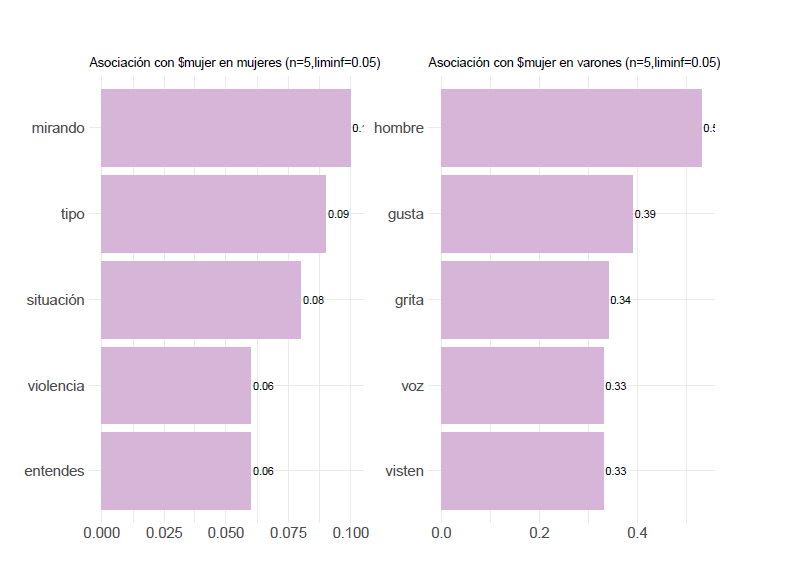
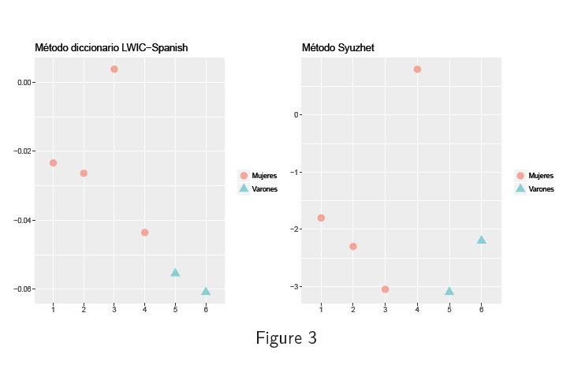
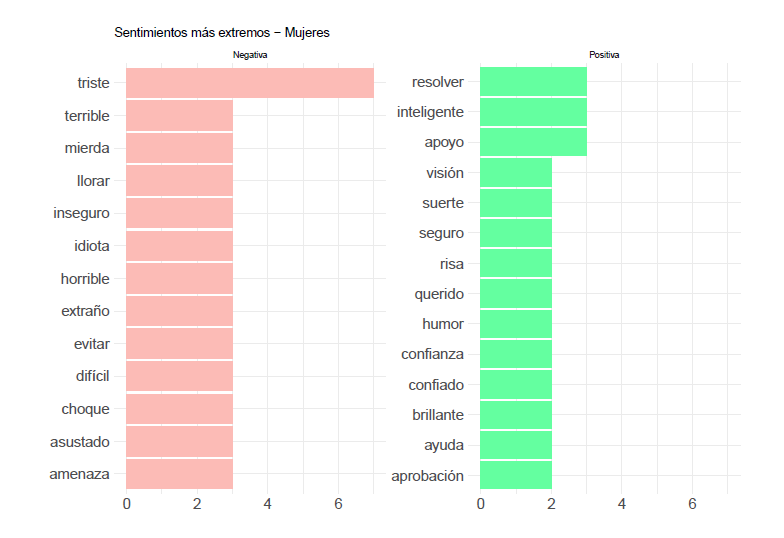

```{r setup, include=FALSE}
knitr::opts_chunk$set(
	echo = TRUE,
	message = FALSE,
	warning = FALSE
)
```


Parte de la presentación que hice en el cumpleaños temático de [RLadies Montevideo](https://twitter.com/RLadiesMVD) el 30 de agosto de 2018, dónde se presentaron varias investigaciones en R sobre género. [Acá están los materiales!](https://github.com/rladies/meetup-presentations_montevideo/tree/master/2018-08-30-1er_a%C3%B1o)

______________


El siguiente es un análisis se desarrolla en el marco del __estudio diagnóstico sobre el acoso sexual y otros tipos de violencia contra las mujeres y niñas en espacios públicos__ en Montevideo. El mismo se enmarca en un convenio suscripto entre ONU Mujeres, la Asesoría para Igualdad de Género de la Intendencia de Montevideo (IM) y la Facultad de Ciencias Sociales (UdelaR).

Representa un ejemplo de las posibilidades analíticas de tipo cualitativo que pueden hacerse desde R, utilizando los paquetes _quanteda_ y _tm_. 


##Definiciones previas:

El estudio concibe al Acoso Sexual Callejero (ASC) como:

_"Incluye comentarios, atención, acciones o gestos con contenido sexual indeseado. Como en
otras formas de violencia sexual, el componente clave del acoso sexual es que alguien
realiza una acción sin el consentimiento, permiso o acuerdo de la persona o personas a las
que se dirige. Acoso sexual incluye formas sin contacto, como comentarios sexuales acerca
del cuerpo o apariencia de la persona, silbidos mientras pasa una mujer, exigencias de
favores sexuales, quedarse mirando de manera sexualmente sugestiva, persecuciones y
seguimiento de una persona, exposición de órganos sexuales. El acoso sexual también
incluye formas físicas de contacto, como frotarse intencionalmente contra alguien en la
calle o en el transporte público, agarrar, pegar una palmada y aproximarse a alguien en una
manera sexual." (ONU Mujeres, 2013)_


## Objetivos del estudio:

- Realizar un análisis textual de grupos de discusión sobre ASC realizados a mujeres y varones.


#I. Análisis textual

```{r cargodatos, message=FALSE, warning=FALSE, include=FALSE}
## seteo

library(devtools)
require(quanteda)
library(readtext)
library(stringr)

mytf<-readtext("grupos_acoso/*", docvarsfrom ="filenames")
myCorpus<-corpus(mytf,text_field="text")
mydfm <- dfm(myCorpus)
##abro un archivo con stopwords
stop=read.csv("stopes.csv",sep=";")
vector=as.character(stop$X0)
mydfm <- dfm(myCorpus,
             stem = FALSE,
             tolower = TRUE,
             remove = c(stopwords("spanish"),vector), 
             remove_punct = TRUE, 
             remove_numbers = TRUE, 
             verbose = TRUE)
words<-featnames(mydfm)
#Saco palabras con 1 y 2 caracteres
words_Length_1<-words[sapply(words,str_length)==1]
words_Length_2<-words[sapply(words,str_length)==2]
otherWords<-c("risas",words_Length_1,words_Length_2) 
mydfm<-dfm(mydfm,remove=otherWords)
```


## Datos existentes

- 6 grupos de discusión sobre la temática ASC, en los cuales participaron mujeres y varones de Montevideo, pertenecientes a diferentes tramos etarios:


|         | Mujeres | Varones|Total
| :-----: |:-------:| :-----:|:-----:|
| Jovenes | 3       | 1      |4      |
| Adultos | 1       | 1      |2      |
| Total   | 4       | 2      |6      |


##Pre-procesamiento

- Abro los archivos de texto en los cuales tengo las transcripciones de los grupos
- Elimino aquellas menciones que corresponden a lxs moderadorxs 
- Guardo como archivos .txt, identificando cada archivo por su nombre según las carcaterísticas del grupo (variables de agrupación posteriores)

##Pre-procesamiento

- Abro los archivos con la función **readtext()**, especificando ubicación de los mismos y variables anexas en los títulos para identificar características del documento


##Pre-procesamiento

- Creo un **corpus** con el paquete **quanteda** 


<!-- ##Pre-procesamiento -->

<!-- ```{r corpus, echo=TRUE, message=FALSE, warning=FALSE, paged.print=FALSE,size="tiny"} -->
<!-- summary(myCorpus) -->
<!-- ``` -->


##_"Limpieza"_ del texto


- Creo un Document feature matrix (DFM), aplicando algunos argumentos que me permiten limpiar las palabras que no me interesan al efecto del análisis. 
    - Homogeinizo las palabras en minúscula
    - Elimino números
    - Elimino puntuaciones 
    - Elimno stopwords (por defecto y lista propia)
    - Elimino palabras con pocos caracteres (1 y 2)
    - Elimino palabras específicas que no me interesan (ej. "Risas")
    
#Nubes de palabras

Creo nubes de palabras con la función _textplot_wordcloud_ y desagrego por grupos de interés. 


##Nubes de palabras: general


```{r echo=FALSE}
textplot_wordcloud(mydfm, min.count = 3,max_words = 200,random.order = FALSE,
                    rot.per = .25, 
                    colors = RColorBrewer::brewer.pal(8,"Dark2"))

```


##Nubes de palabras: grupos


##Nubes de palabras: mujeres/varones

```{r wccomp2, echo=FALSE, message=FALSE, warning=FALSE}
dfm_sexo <- dfm(mydfm, groups = "docvar1")
textplot_wordcloud(dfm_sexo, min.count = 2,max_words = 200,random.order = FALSE,
                   rot.per = .25, 
                   colors = RColorBrewer::brewer.pal(8,"Dark2"),comparison = T)
```


#Agrupación de palabras

##Agrupación de palabras

- Para dar cuenta de la agrupación de palabras, uso el paquete **tm** y, a diferencia del análisis anterior, considero cada mención como un elemento del corpus
- Calculo las distancias entre los términos y armo _clusters_ de palabras (método euclidiano)
- Grafico la agrupación jerárquica de las palabras en un dendograma, separada entre grupos (método de Ward)

##Agrupación de palabras: mujeres


##Agrupación de palabras: varones


##Asociación de palabras

- Para analizar las asociaciones entre palabras, consideramos una dispersión de 0.995 
- Buscamos la asociación de palabras, considerando una correlación mínima de 0.05
- Al tratarse de menciones y no de grupos, la dispersión entre términos es muy alta
- Analizamos la asociación con las palabras: _calle_, _acoso_ y _mujer_

##Asociaciónde palabras: $calle


##Asociación de palabras: $acoso


##Asociaciónde palabras: $mujer



#Análisis de sentimiento


##Análisis de sentimiento

Se presentan dos métodos para analizar sentimiento de los documentos:

- Diccionario LWIC-Spanish: con la función dfm_lookup() de _quanteda_ identifica en los documentos las emociones presentes en el diccionario y establece puntajes para cada uno, a partir de la estandarización de los mismos (conicidencia únicamente de 15% entre términos).   

- Método Syuzhet: utiliza la función get_sentiment() de _syuzhet_ asigna puntajes a cada documento según el método y lenguaje indicado. El método **syuzhet** es un diccionario de sentimientos desarrollado en el Laboratorio Literario de Nebraska. Otros métodos: _bing_, _afinn_, _nrc_ y _stanford_. 


##Análisis de sentimiento

Comparación entre los métodos:



##Análisis de sentimiento: mujeres



##Análisis de sentimiento: varones


