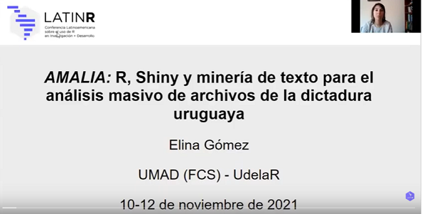

```{r setup, include=FALSE}
knitr::opts_chunk$set(
	echo = TRUE,
	message = FALSE,
	warning = FALSE
)
```


En el marco de la conferencia regional [LatinR 2021](https://latin-r.com/), presenté la aplicación _AMALIA_, dejo video de la ponencia:


[](https://youtu.be/mquWWrM8eqo "AMALIA")

______________


**AMALIA** es una aplicación que surge como una iniciativa en el marco del proyecto [CRUZAR](https://cruzar.edu.uy/) (_Sistema de Información de Archivos del Pasado Reciente_), y que a través de técnicas de minería de texto, busca aportar en el análisis masivo e interactivo de documentos de la dictadura uruguaya (1973-1985) que han sido digitalizados y convertidos a texto mediante técnicas de OCR. La misma ha sido desarrollada utilizando el lenguaje R y se encuentra en su versión de prueba. Se nutre de más de 100000 imágenes que conforman el denominado _Archivo Berruti_, y permite realizar búsqueda de términos y palabras, analizar las inter-conexiones entre los mismos, así como el contexto en que son mencionadas en los archivos. 

______________


### Estructura general:


- Buscador:

El buscador parte de un listado de palabras validadas previamente a partir de su inclusión en los diccionarios pre-definidos y permite evaluar tanto la frecuencia de aparición de un término como la co-ocurrencia entre diferentes palabras en las unidades de agregación. Así también plantea la posibilidad de analizar su contexto de mención en el texto bruto.

- Explorador:

El explorador permite realizar un análisis partiendo de lo general a lo particular ya que es posible seleccionar un sub-conjunto de documentos y explorar las temáticas que incluye a partir de las frecuencias de términos, nubes de palabras, co-ocurrencia, redes de palabras y asociaciones. También es posible dirigir el análisis seleccionando los diccionarios de interés.

- Analizador:

El analizador plantea un análisis centrado en el contexto en que se menciona una determinada palabra o conjunto de palabras previamente validadas por los diccionarios, a partir de la frecuencia, redes de términos y asociación entre las palabras que forman parte de dicho contexto.


### Paquetes utilizados:

- _shiny_ , _shinythemes_, _shinyWidgets_, _shinycssloaders_ , _wordclouds2_ , _DT_ para diseñar la estructura de la aplicación, formato, visualizaciones. 

- _dbplyr_ para hacer conexión con la base en Postgres y optimizar las búsquedas SQL. 

- _quanteda_ ( _quanteda.textmodels_, _quanteda.textplots_, _quanteda.textstats_) para visualizacione y cálculos de co-ocurrencias y distancias entre términos.

- Otros: _dplyr_ , _ggplot2_, _seededlda_


______________
